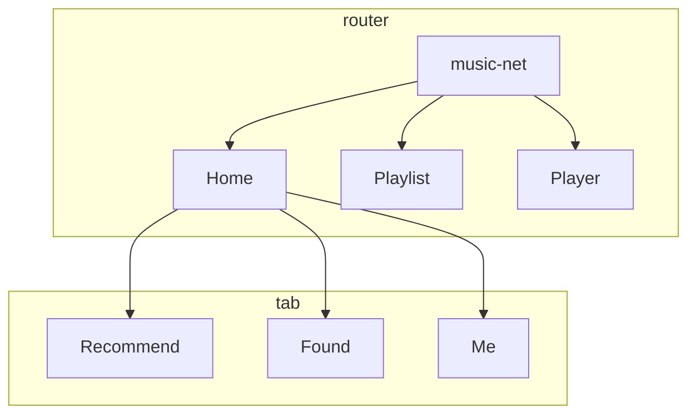

### BUILD

1. Clone project to `gaia/apps/`
2. Add "app/music-net" in `gaia/build/config/phone/apps-engineering.list` & `build/config/phone/apps-production.list`
3. Run `APP=music-net make`
4. Push Application into device first time(? -> shi.tan)
5. Make install `APP=music-net make install-gaia` any time when code updated.

### STRUCTURE




### Test
#### Test Samples
- Test SnapShot
```javascript
  it('renders correctly', () => {
    let snapshotComponent = renderer.create(
      <Provider store={store}>
        <Player />
      </Provider>
    );

    expect(snapshotComponent).toMatchSnapshot();
  });
```

- Simulate `Keydown` event
  ```javascript
  component.find('.player').simulate('keydown', {key: 'Enter'});
  ```

- Test Redux actions [ref](https://www.digitalocean.com/community/tutorials/react-testing-redux-actions)
  ```javascript
    it('should dispatch an "togglePlayer" action when Enter key pressed', () => {
      let component;

      component = mount(
        <Provider store={store}>
          <Player />
        </Provider>
      );

      let fetchSongURLAction = {type: 'FETCH_SONGURL_BEGIN'};
      // will fetch song when Player mount
      expect(store.getActions()[0]).toEqual(fetchSongURLAction);

      component.find('.player').simulate('keydown', {key: 'Enter'});

      // be careful about getActions return.
      expect(store.getActions()[1]).toEqual(togglePlayer());
    });
  ```


#### Jest
- jest test react connect component [DOC](https://www.robinwieruch.de/react-connected-component-test)

- `fileMock` and `styleMock`

- setup file, will run before every test to build environment like set `enzyme adapter`.
  ```javascript
  import Enzyme from 'enzyme';
  import Adapter from '@wojtekmaj/enzyme-adapter-react-17';

  Enzyme.configure({ adapter: new Adapter() });
  ```

#### enzyme
- config
  ```json
  {
    "enzyme": "^3.11.0",
    "enzyme-to-json": "^3.6.1",
    "@wojtekmaj/enzyme-adapter-react-17": "^0.3.2"
  }
  ```
- enzyme-adapter-react-17
[ref](https://github.com/enzymejs/enzyme/issues/2429#issuecomment-679265564)


- [shallow](https://enzymejs.github.io/enzyme/docs/api/shallow.html), [mount](https://enzymejs.github.io/enzyme/docs/api/mount.html), [render](https://enzymejs.github.io/enzyme/docs/api/render.html)
  - mount, use mount can simulate event like this:
  ```javascript
      component = mount(
        <Provider store={store}>
          <Player />
        </Provider>
      );

      component.find('.player').simulate('keydown', {key: 'Enter'});
  ```
#### redux-mock-store
 [API DOC](https://github.com/reduxjs/redux-mock-store#api)

- config
  ```json
  {
    "redux-mock-store": "^1.5.4"
  }
  ```
- [API DOC](https://github.com/reduxjs/redux-mock-store#api)
  - [x] getActions
    ```javascript
    // be careful about getActions return.
    expect(store.getActions()[0]).toEqual(togglePlayer());
    ```
  - [ ] getState
  - [ ] dispatch
  - [x] clearActions
    ```javascript
    beforeEach(() => {
      store = mockStore({
        playedState: 'stop',
        loopMode: 'list'
      });

      component = mount(
        <Provider store={store}>
          <Player />
        </Provider>
      );

      // before each test item we clean already received actions
      store.clearActions();
    });
    ```
  - [ ] subscribe
  - [ ] replaceReducer


### ROUTER

lib: "react-router-dom": "^5.2.0"

1. `exact`

   To prevent unexpect path match, like `/` will be matched when we path name push `/play`.

   ## [exact: bool](https://reactrouter.com/web/api/Route/exact-bool)

   When `true`, will only match if the path matches the `location.pathname` *exactly*.

   ```jsx
   <Route exact path="/one">
     <About />
   </Route>
   ```

   |  path  | location.pathname |  exact  | matches? |
   | :----: | :---------------: | :-----: | :------: |
   | `/one` |    `/one/two`     | `true`  |    no    |
   | `/one` |    `/one/two`     | `false` |   yes    |

2. `<Redirect />`

   default KaiOS app location will be `app://music-net.gaiamobile.org/index.html`, use `<Redirect />` will let location change to `app://music-net.gaiamobile.org/` as wish to show `Home`

### FOCUS

current we set focus when component did mount callback, not sure if it suitable.

```js
  componentDidMount() {
    this.focus();
  }

  focus() {
    this.element.focus();
  }
```


