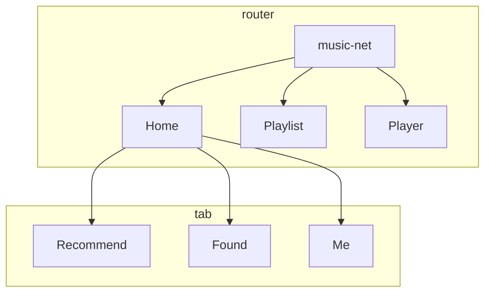

### BUILD

1. Clone project to `gaia/apps/`
2. Add "app/music-net" in `gaia/build/config/phone/apps-engineering.list` & `build/config/phone/apps-production.list`
3. Run `APP=music-net make`
4. Push Application into device first time
5. Make install `APP=music-net make install-gaia` any time when code updated.

### STRUCTURE



### neteaseCloudMusic API use
1. To ensure that current server can be used normally, please connect your phone to `kaios-2G`.
2. API server is currently temporarily set up on wenyan's local PC to facilitate development, and later needs to be integrated in the code to directly access the netease cloud api.
3. If you want to build an api server by yourself, follow these step:
- fetch this github: [NeteaseCloudMusicApi](https://github.com/Binaryify/NeteaseCloudMusicApi) code to your local, start server by use: `node app.js`
- modify music-net/src/service/neteaseCloudMusicApi.js `HOST` parameter to `http://$(local ip address):3000`
- make sure your PC and device are connected to the same wifi.

#### Recommend
```javascript
const sampleRecommendList =
  {
    "data": {
      "hasTaste": false,
      "code": 200,
      "category": 0,
      "result": [{
        "id": 4926865057,
        "type": 0,
        "name": "夜间咖啡馆|西餐馆|傍晚的乐器演奏家",
        "copywriter": "编辑推荐：本单包含Bossa nova、民谣风、爵士乐、中世纪风格",
        "picUrl": "https://p1.music.126.net/Jh1iS5wFR5Xz_GNML996VA==/109951165046243126.jpg",
        "canDislike": false,
        "trackNumberUpdateTime": 1607590232764,
        "playCount": 83431,
        "trackCount": 28,
        "highQuality": false,
        "alg": "featured"
      }, {
        "id": 5097412008,
        "type": 0,
        "name": "网郁云 “那晚我悲痛欲绝”",
        "copywriter": "热门歌单推荐",
        "picUrl": "https://p1.music.126.net/2YOC31gtmRjoB-K5FSOE_w==/109951165520586580.jpg",
        "canDislike": true,
        "trackNumberUpdateTime": 1607996811286,
        "playCount": 946498,
        "trackCount": 260,
        "highQuality": false,
        "alg": "hot_server"
      }]
    }
  };
```
#### Playlist
```json
[{
  "picUrl":"http://p3.music.126.net/UeTuwE7pvjBpypWLudqukA==/3132508627578625.jpg",
  "name":"corpse bride",
  "id":490602785,
  "ar":"AVALON"
 },
 {
  "picUrl":"http://p3.music.126.net/xa_9E77HUiQUdsCWwcHkOw==/109951163534309771.jpg",
  "name":"For a While",
  "id":1307474593,
  "ar":"Fenne Lily"
 },
 {
  "picUrl":"http://p4.music.126.net/4YLeBH86MTluZLqojCz9nQ==/109951164616015223.jpg",
  "name":"Loving Strangers",
  "id":2788529,
  "ar":"Jocelyn Pook"
 },
 {
   "picUrl":"http://p3.music.126.net/xTzZZgKDPYA83qsVcwmBpA==/109951164514880022.jpg",
   "name":"12.25.16 [untitled christmas song]",
   "id":1406360777,
   "ar":"Crywolf"
 }]
```


### Test
#### Test Samples
- Test SnapShot
```javascript
  it('renders correctly', () => {
    let snapshotComponent = renderer.create(
      <Provider store={store}>
        <Player />
      </Provider>
    );

    expect(snapshotComponent).toMatchSnapshot();
  });
```

- Simulate `Keydown` event
  ```javascript
  component.find('.player').simulate('keydown', {key: 'Enter'});
  ```

- Test Redux actions [ref](https://www.digitalocean.com/community/tutorials/react-testing-redux-actions)
  ```javascript
    it('should dispatch an "togglePlayer" action when Enter key pressed', () => {
      let component;

      component = mount(
        <Provider store={store}>
          <Player />
        </Provider>
      );

      let fetchSongURLAction = {type: 'FETCH_SONGURL_BEGIN'};
      // will fetch song when Player mount
      expect(store.getActions()[0]).toEqual(fetchSongURLAction);

      component.find('.player').simulate('keydown', {key: 'Enter'});

      // be careful about getActions return.
      expect(store.getActions()[1]).toEqual(togglePlayer());
    });
  ```


#### Jest
- jest test react connect component [DOC](https://www.robinwieruch.de/react-connected-component-test)

- `fileMock` and `styleMock`

- setup file, will run before every test to build environment like set `enzyme adapter`.
  ```javascript
  import Enzyme from 'enzyme';
  import Adapter from '@wojtekmaj/enzyme-adapter-react-17';

  Enzyme.configure({ adapter: new Adapter() });
  ```

#### enzyme
- config
  ```json
  {
    "enzyme": "^3.11.0",
    "enzyme-to-json": "^3.6.1",
    "@wojtekmaj/enzyme-adapter-react-17": "^0.3.2"
  }
  ```
- enzyme-adapter-react-17
[ref](https://github.com/enzymejs/enzyme/issues/2429#issuecomment-679265564)


- [shallow](https://enzymejs.github.io/enzyme/docs/api/shallow.html), [mount](https://enzymejs.github.io/enzyme/docs/api/mount.html), [render](https://enzymejs.github.io/enzyme/docs/api/render.html)
  - mount, use mount can simulate event like this:
  ```javascript
      component = mount(
        <Provider store={store}>
          <Player />
        </Provider>
      );

      component.find('.player').simulate('keydown', {key: 'Enter'});
  ```
#### redux-mock-store
 [API DOC](https://github.com/reduxjs/redux-mock-store#api)

- config
  ```json
  {
    "redux-mock-store": "^1.5.4"
  }
  ```
- [API DOC](https://github.com/reduxjs/redux-mock-store#api)
  - [x] getActions
    ```javascript
    // be careful about getActions return.
    expect(store.getActions()[0]).toEqual(togglePlayer());
    ```
  - [ ] getState
  - [ ] dispatch
  - [x] clearActions
    ```javascript
    beforeEach(() => {
      store = mockStore({
        playedState: 'stop',
        loopMode: 'list'
      });

      component = mount(
        <Provider store={store}>
          <Player />
        </Provider>
      );

      // before each test item we clean already received actions
      store.clearActions();
    });
    ```
  - [ ] subscribe
  - [ ] replaceReducer


## IN CODE
### Redux
1. compose:
```javascript
import { compose } from 'redux';

export default compose(
  withRouter,
  connect(mapStateToProps, mapDispatchToProps)
)(Recommend);
```


### ROUTER

lib: "react-router-dom": "^5.2.0"

1. `exact`

   To prevent unexpect path match, like `/` will be matched when we path name push `/play`.

   ## [exact: bool](https://reactrouter.com/web/api/Route/exact-bool)

   When `true`, will only match if the path matches the `location.pathname` *exactly*.

   ```jsx
   <Route exact path="/one">
     <About />
   </Route>
   ```

   |  path  | location.pathname |  exact  | matches? |
   | :----: | :---------------: | :-----: | :------: |
   | `/one` |    `/one/two`     | `true`  |    no    |
   | `/one` |    `/one/two`     | `false` |   yes    |

2. `<Redirect />`

   default KaiOS app location will be `app://music-net.gaiamobile.org/index.html`, use `<Redirect />` will let location change to `app://music-net.gaiamobile.org/` as wish to show `Home`

3. `withRouter`
```javascript
import { withRouter } from 'react-router';
```


### FOCUS

current we set focus when component did mount callback, not sure if it suitable.

```js
  componentDidMount() {
    this.focus();
  }

  focus() {
    this.element.focus();
  }
```


